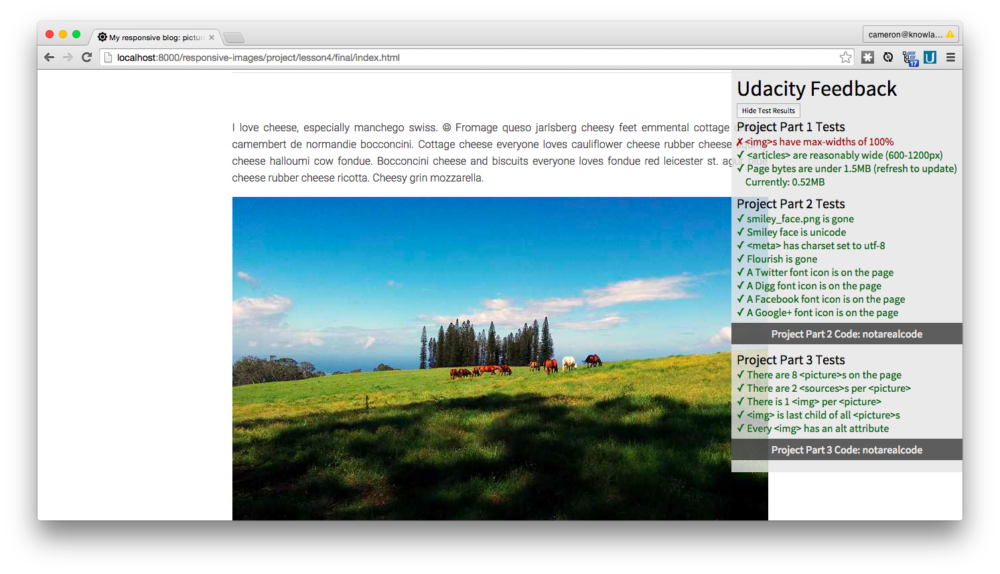
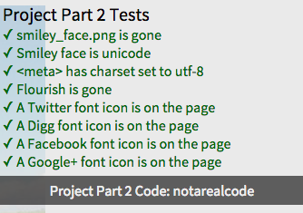
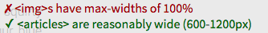

# Udacity Font-End Grading Engine
 - v0.11

Providing immediate feedback for front-end code

*Screenshot of Grading Engine*

## What It Is ##

A platform to run tests against the `document` and provide feedback. Any edits made in HTML or through DevTools can be registered by the grading engine.

The tests are organized into suites, each of which consists of multiple tests. Once a suite of tests passes, a code is displayed. Copy the code into the Udacity classroom to pass the quiz.

*A test suite and completion code*

## Reading the feedback ##

Each test refreshes once a second. While the test is pending completion, it will display in red and start with an ✗ mark. Once a test is completed, a ✓ will appear and the test will turn green.

*A test that passed and a test that's pending completion*

## Writing Tests... aka The API ##

TBC
