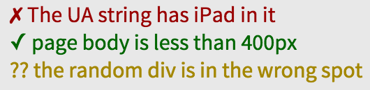

# Udacity Feedback Chrome Extension

Immediate, visual feedback about any website's HTML, CSS and JavaScript.

* Not sure what this is? Try the [walkthrough](http://labs.udacity.com/udacity-feedback-extension/).
* Just want to install? Visit the [Chrome Web Store](https://chrome.google.com/webstore/detail/fcglckhmjjmhkfkkngemmhmcolefiljf).

## Installing from Source

1. Clone this repo
2. `npm install` - install dependencies
3. `gulp watch` or just `gulp` - build the grading engine
4. [Load in Chrome](https://developer.chrome.com/extensions/getstarted#unpacked)
  * Open the Extensions window
  * Check 'Developer Mode'
  * Click 'Load unpacked extension...'
  * Select `ext/`

## Loading Tests

### On sites you own

Add the following meta tag:

```html
<meta name="udacity-grader" content="relative_path_to_tests.json">
```

There are two optional attributes: `libraries` and `unit-tests`. `libraries` is always optional and `unit-tests` is only necessary for JS quizzes. More on JS tests [here](#js-tests).

### On sites you don't own

Click on the Udacity browser action. Choose 'Load tests' and navigate to a JSON.

## API

### JSON

Typical structure is an array of:

    suite
    |_name
    |_code
    |_tests
      |_description
      |_definition
      | |_nodes
      | |_collector
      | |_reporter
      |
      |_[flags]

Example:

```javascript
[{
  "name": "Learning Udacity Feedback",
  "code": "This can be an encouraging message",
  "tests": [
    {
      "description": "Test 1 has correct bg color",
      "definition": {
        "nodes": ".test1",
        "cssProperty": "backgroundColor",
        "equals": "rgb(204, 204, 255)"
      }
    }
  ]
},
{
  "name": "More 'dacity Feedback",
  "code": "Some message",
  "tests": [
    {
      "description": "Test 2 says 'Hello, world!'",
      "definition": {
        "nodes": ".test2",
        "get": "innerHTML",
        "hasSubstring": "^Hello, world!$"
      }
    },
    {
      "description": "Test 3 has two columns",
      "definition": {
        "nodes": ".test4",
        "get": "count",
        "equals": 2
      }
    },
    {
      "description": "Test 4 has been dispatched",
      "definition": {
        "waitForEvent": "ud-test",
        "exists": true
      },
      "flags": {
        "noRepeat": true
      }
    }
  ]
}]
```

*Note that the feedback JSON must be an array of objects*

* `"name"`: the name of the suite. The word "Test" or "Tests" gets appended when this name shows up in the widget as a heading for its child tests.
* `"code"`: a message to display when all tests in the suite pass. Why is it called a code? It's sometimes the code I make students copy and paste into a quiz on the Udacity site to prove they finished the quiz.
* `"tests"`: an array of test objects
  * `"description"`: shows up in the test widget. Try to keep titles short, as long titles don't wrap well in the current version.
  * `"definition"`: an object with collector and reporter properties. More on this below.
  * `"flags"`: optional flags to alter the way a test is run. The most common is `noRepeat`, which ensures that a test runs only once rather than repeatedly.

### How to write a `"definition"`

Think about this sentence as you write tests:

> I want the nodes of [selector] to have [some property] that [compares to some value].

#### 1) Start with `"nodes"`. Every* test against the DOM needs some nodes to examine. This is the start of a "collector".

```javascript
"definition": {
  "nodes": "selector",
  ...
}
```

**Two exceptions: collecting a user-agent string or in conjunction with `"waitForEvent"`.*

#### 2) Decide what value you want to collect and test.

**CSS:**

```javascript
"definition": {
  "nodes": ".anything"
  "cssProperty": "backgroundColor",
  ...
}
```

The `"cssProperty"` can be the camelCase version of [any CSS property](https://developer.mozilla.org/en-US/docs/Web/CSS/CSS_Properties_Reference). `"cssProperty"` takes advantage of `window.getComputedStyle()`.

* Colors will be returned in the form of `"rgb(255, 255, 255)"`. Note the spaces.
* All `width`, `margin`, etc measurements are returned as pixel values, not percentages.

**Attribute:**

```javascript
"definition": {
  "nodes": "input"
  "attribute": "for",
  ...
}
```

Any attribute works.

**Absolute Position:**

```javascript
"definition": {
  "nodes": ".left-nav"
  "absolutePosition": "side",
  ...
}
```

Side must be one of: `top`, `left`, `bottom`, or `right`. Currently, the position returned is relative to the viewport, which TBH, seems odd. Be careful because the behavior of `"absolutePosition"` may change in the future.

**Count, innerHTML, ChildPosition, and UAString:**

```javascript
"definition": {
  "nodes": ".box"
  "get": "count",
  ...
}
```

These four tests (`"count"`, `"innerHTML"`, `"childPositions"` and `"UAString"`) use `"get"` and they are the only tests that use `"get"`. Each of them returns basically what you'd expect. Remember the asterix from earlier about the necessity of `"nodes"`? User-agent strings are one of the exceptions - you can `"get": "UAString"` without `"nodes"`.

"Child position? I haven't seen anything about children." - a question you might be asking yourself. Let me answer it.

**Children**

```javascript
"definition": {
  "nodes": ".flex-container",
  "children": "div",
  "absolutePosition": "side",
  ...
}
```

`"children"` is a deep children selector. In this example, it was used to select all the divs inside a flex container. Now, reporters will run tests against all of the child divs, not the parent flex container.

#### 3) Decide how you want to grade the values you just collected. This is a "reporter".

**Equals**

```javascript
"definition": {
  "nodes": ".flex",
  "get": "count",
  "equals": 4
}
```
 
or

```javascript
"definition": {
  "nodes": "input.billing-address",
  "attribute": "for",
  "equals": "billing-address"
}
```

Set `"equals"` to either strings or numbers. It looks for an exact match. In the first example, the test passes when the count of nodes returned by the selector equals four. In the second, the `for` attribute of `<input class="billing-address">` must be set to `"billing-address"`. If you want to compare strings and would prefer to use regex, try `"hasSubstring"`.

**Exists**

```javascript
"definition": {
  "nodes": "input.billing-address",
  "attribute": "for",
  "exists": true
}
```

In this example, rather than looking for a specific `for`, I'm just checking to see that it exists at all. The value doesn't matter. If `"exists": false`, then the test will only pass if the attribute does not exist.

**Comparison**

```javascript
"definition": {
  "nodes": ".flex",
  "get": "count",
  "isLessThan": 4
}
```

`"isLessThan"` and `"isGreaterThan"` share identical behavior.

```javascript
  "definition": {
    "nodes": ".flex",
    "get": "count",
    "isInRange": {
      "lower": 4,
      "upper": 10
    }
  }
```

Set an `"upper"` and a `"lower"` value for `"isInRange"`.

**Substrings**

```javascript
"definition": {
  "nodes": ".text",
  "get": "innerHTML",
  "hasSubstring": "([A-Z])\w+"
}
```

Run regex tests against strings with `"hasSubstring"`. If one or more match groups are returned, the test passes. There are also some optional configs for `"hasSubstring"`.

```javascript
"definition": {
  "nodes": ".text",
  "get": "innerHTML",
  "hasSubstring": {
    "expected": [
      "([A-Z])\w+",
      "$another^"
    ],
    "minValues": 1,
    "maxValues": 2
  }
}
```

This test checks that either one or both of the expected values are found.

Feel free to mix and match these. If there is an array of `"expected"` regexes, you can use `"minValues"` and `"maxValues"` to determine how many of the expected values need to match in order for the test to pass. Without `"minValues"` and `"maxValues"`, all regexes will need to be matched in order for the test to pass.

**Utility Properties - `not`, `limit`**

```javascript
"definition": {
  "nodes": ".text",
  "get": "innerHTML",
  "not": true,
  "hasSubstring": "([A-Z])\w+"
}
```

Switch behavior with `"not"`. A failing test will now pass and vice versa.

```javascript
"definition": {
  "nodes": ".title",
  "cssProperty": "marginTop",
  "limit": 1,
  "equals": 10
}
```

Currently, the values supported by `"limit"` are `1` and `"some"`.

Remember, by default every node collected by `"nodes"` or `"children"` must pass the test specified. To change that, use `"limit"`. If `1`, only one of the values collected should pass. If more than one value passes, the test fails. In the case of `"some"`, `1 < number < all` values should pass in order for the test to pass. If all, one, or 0 values pass, then the test fails.

**Flags**

```javascript
"definition": {
  "nodes": ".small",
  "cssProperty": "borderLeft",
  "equals": 10
},
"flags": {
  "noRepeat": true
}
```

Options here currently include `"noRepeat"` and `"alwaysRun"`.

By default, a test runs every 1000ms until it either passes or encounters an error. If `"noRepeat"` is set, the test only runs once when the widget loads and does not rerun every 1000ms. If `"alwaysRun"`, the test continues to run even after it passes.

###<a name="js-tests"></a> JavaScript Tests

```javascript
"definition": {
  "waitForEvent": "custom-event",
  "exists": true
}
```

For security reasons, you can only run JavaScript tests against pages that you control. You can trigger tests by dispatching custom events from inside your application or from a script linked in the `unit-tests` attribute of the meta tag. Set `"waitForEvent"` to a custom event. As soon as the custom event is detected, the test passes.

Example of a custom event:

```javascript
window.dispatchEvent(new CustomEvent('ud-test', {'detail': 'passed'}));
```

I like to use the [jsgrader library](https://github.com/udacity/js-grader) for writing JS tests because it supports grading checkpoints (logic to say "stop grading if this test fails"). You can use it too by setting `libraries="jsgrader"` in the meta tag.].

### Test States and Debugging



Green tests with ✓ have passed, red tests with ✗ have failed and yellow tests with ?? have some kind of error. If there is an error, run `UdacityFEGradingEngine.debug()` from the console to see why the yellow tests are erring.

## How Udacity Feedback Works

At the core of Udacity Feedback is the grading engine. The grading engine performs two tasks: collecting information from the DOM and reporting on it. Each test creates its own instance of the grading engine which queries the DOM once a second (unless otherwise specified).

### Overview of the source code:

* **TA** (Teaching Assistant). The TA orchestrates the DOM querying and comparison logic of the grading engine. There is a collection aspect (src/js/TACollectors.js) and a reporting aspect (src/js/TAReporters.js). Collectors pull info from the DOM. Reporters are responsible for the logic of evaluating the information. The TA executes tests as a series of async methods pulled from a Queue.
* **Gradebook**. Every TA has an instance of a Gradebook, which determines the pass/fail state of a test. Some tests have multiple parts (eg. examining every element of some class to ensure that all have a blue background - each element is a part of the test). The Gradebook compares the parts to the comparison functions as set by the TA and decides if the test has passed or failed.
* **Target**. A Target represents a single piece of information pulled from the DOM. *Almost* every Target has an associated `element` and some `value`. Targets may include child Targets. Tests that result in multiple pieces of information create a tree of Targets (sometimes called a 'Bullseye' in comments).
* **Suite** and **ActiveTest**. An individual test (ie. one line in the widget) is an instance of an ActiveTest. ActiveTests are organized into Suites. Each Suite comes with its own name, which is displayed above its set of tests in the widget.
* **Registrar**. This file contains the logic for creating new tests when the Feedback is turned on and removing tests when the Feedback is turned off.
* The `<test-widget>` and everything inside of it were built as custom elements with HTML imports.

Did you read this far? You're awesome :)
